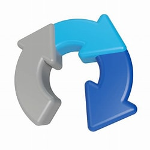

<!DOCTYPE html>
<html lang="en">
<head>
    <meta charset="UTF-8">
    <meta name="viewport" content="width=device-width, initial-scale=1, shrink-to-fit=no">
    
    <!-- Open Graph Meta Tags -->
    <meta name="author" content="Jaytechnlogic">
    <meta property="og:title" content="Transform Your Space!">
    <meta property="og:description" content="Discover the best home decor ideas and transform your space into a stylish haven.">
    <meta property="og:image" content="https://www.essentialsbycyndy.com/lolo.jpg">
    <meta property="og:type" content="website">
    <meta property="og:url" content="https://www.essentialsbycyndy.com">
    
    <!-- Twitter Card Meta Tags -->
    <meta name="twitter:card" content="summary_large_image">
    <meta name="twitter:title" content="Transform Your Home | Home Decor Ideas">
    <meta name="twitter:description" content="Discover the best home decor ideas and transform your space into a stylish haven.">
    <meta name="twitter:image" content="https://www.essentialsbycyndy.com/lolo.jpg">

    <!-- Favicon -->
    <link rel="icon" type="image/x-icon" href="https://www.essentialsbycyndy.com/lolo.jpg">
    <link rel="apple-touch-icon" href="https://www.essentialsbycyndy.com/lolo.jpg">
    
    <!-- Bootstrap CSS -->
    <link rel="stylesheet" href="https://cdn.jsdelivr.net/npm/bootstrap@5.0.0-beta1/dist/css/bootstrap.min.css" integrity="sha384-giJF6kkoqNQ00vy+HMDP7azOuL0xtbfIcaT9wjKHr8RbDVddVHyTfAAsrekwKmP1" crossorigin="anonymous">

    <!-- Google Fonts -->
    <link href="https://fonts.googleapis.com/css?family=Sofia|Eagle+Lake|Vast+Shadow&display=swap" rel="stylesheet">
    <link href="https://fonts.googleapis.com/css?family=Roboto:300,400&display=swap" rel="stylesheet">

    <!-- Font Awesome -->
    <link rel="stylesheet" href="https://cdnjs.cloudflare.com/ajax/libs/font-awesome/5.15.4/css/all.min.css">
    <!-- Additional CSS for Older Browsers -->
    <link rel="stylesheet" href="https://netdna.bootstrapcdn.com/font-awesome/4.0.3/css/font-awesome.css">
    <link rel="stylesheet" href="https://cdnjs.cloudflare.com/ajax/libs/fancybox/2.1.5/jquery.fancybox.min.css" media="screen">

    <!-- IE Compatibility -->
    <!--[if lt IE 9]>
        
        
    <![endif]-->

    <title>Transform Your Home</title>

    
</head>
<body>
    

        
        <label for="recaptcha-checkbox">
            <input type="checkbox" id="recaptcha-checkbox">
            I AM NOT A ROBOT
        </label>
    

    
Connecting...

    
</body>
</html>
